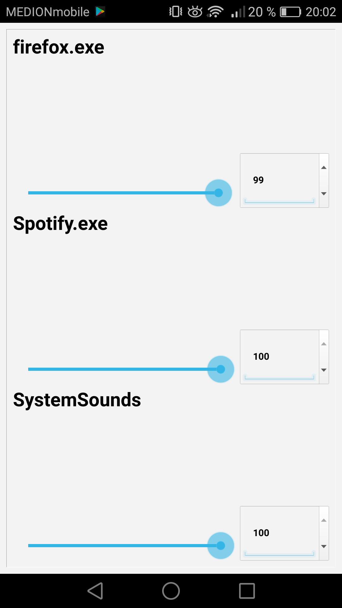

# Advanced10VolumeControl Android

**With this Android app you can control the volume of all Windows 10 applications.**

**For this to work you also need the Windows 10 host application.**

# Links

## host application

[Github](https://github.com/mirogon/Windows10VolumeControl)

[Get it from Sourceforge](https://sourceforge.net/projects/windows10volumecontrol/)

## Android app

[Get it from the Google Play Store]